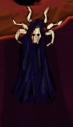
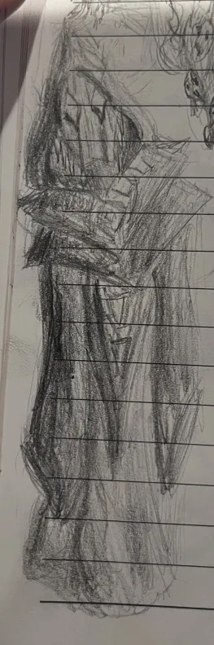
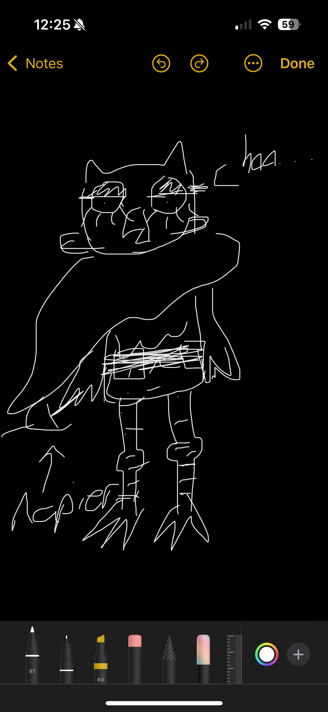

1. [Chree (Matts Character)](#Chree%20(Matts%20Character))
		1. [Visual Resources:](#Visual%20Resources:)
		2. [Traits:](#Traits:)
2. [Knox (Gavin's character)](#Knox%20(Gavin's%20character))
		1. [Visual Resources:](#Visual%20Resources:)
		2. [Traits:](#Traits:)
3. [Mordecai (Riley's character)](#Mordecai%20(Riley's%20character))
		1. [Visual Resources:](#Visual%20Resources:)
		2. [Traits:](#Traits:)
4. [Mudd (Crey's character)](#Mudd%20(Crey's%20character))
		1. [Visual Resources:](#Visual%20Resources:)
		2. [Traits:](#Traits:)
5. [Rhoggo (Laprades character)](#Rhoggo%20(Laprades%20character))
		1. [Visual Resources:](#Visual%20Resources:)
		2. [Traits:](#Traits:)
6. [Skiggs (Buchmans character (The main character tbh))](#Skiggs%20(Buchmans%20character%20(The%20main%20character%20tbh)))
		1. [Visual Resources:](#Visual%20Resources:)
		2. [Traits:](#Traits:)
		3. [Visual Resources:](#Visual%20Resources:)
		4. [Traits:](#Traits:)
7. [Pheobe (Willows character)](#Pheobe%20(Willows%20character))
		1. [Visual Resources:](#Visual%20Resources:)
		2. [Traits:](#Traits:)

# Chree (Matts Character)
### Visual Resources:

https://www.heroforge.com/load_config%3D56193937/

### Traits:
Class: Druid
Race: Goliath
Height: 7-8 Feet
Quirks:
- Silly guy
- Loves to summon beast
- Tree hugger
# Knox (Gavin's character)
### Visual Resources:
[https://www.heroforge.com/load_config%3D56193937/](https://www.heroforge.com/load_config%3D56193937/ "https://www.heroforge.com/load_config%3D56193937/")
### Traits:
Class: Ranger
Race: Human
Height: 5-6 feet
Quirks:
- Serious Guy who lost everyone except his daughter
- Is very tucker like
- Serious and easy to make suspicious
- Keeps busy by sniffing into business
# Mordecai (Riley's character)

### Visual Resources:
[https://www.heroforge.com/load_config%3D56084994/](https://www.heroforge.com/load_config%3D56084994/ "https://www.heroforge.com/load_config%3D56084994/")

### Traits:
Class: Warlock
Race: Tiefling
Height: 5-6 feet
Quirks:
- Serious Guy who's kind of suspicious
- keeps to himself but works well with others
- Needs to eat blood or something idk i wasn't really paying attention
- waaaaaaaaooooo (regular show bird or something idk)
# Mudd (Crey's character)
### Visual Resources:
[https://www.heroforge.com/load_config%3D56117805/](https://www.heroforge.com/load_config%3D56117805/ "https://www.heroforge.com/load_config%3D56117805/")
### Traits:
Class: Cleric
Race: Human? idrk man 
Height: 5'11 ft
Quirks:
- Chaotic Evil
- Silly Silly Silly man
- Loves the sauna
- Pretends he's chaotic evil but is just kinda chaotic
- was captured by pirates (that is how we found him)
- looooooooves to drink

# Rhoggo (Laprades character)
### Visual Resources:
[https://www.heroforge.com/load_config%3D56117805/](https://www.heroforge.com/load_config%3D56117805/ "https://www.heroforge.com/load_config%3D56117805/")

### Traits:
Class: Swashbuckler Rogue
Race: brass dragonborne
Height: "6'7 - 6'9 ish" - Lack
Quirks:
- Buddies with all
- looooooooves to drink
- "as for attributes he's a brass dragonborn, so he's kind of got a warm gold/orange pigmentation, and he has a kind of frilly, reptillian "beard". some of which can act almost like a pipe to let off smoke or fire" - Lack
- Rugged and tattered

# Skiggs (Buchmans character (The main character tbh))
### Visual Resources:
[https://www.heroforge.com/load_config%3D56117805/](https://www.heroforge.com/load_config%3D56117805/ "https://www.heroforge.com/load_config%3D56117805/")

### Traits:
Class: Swashbuckler Rogue
Race: brass dragonborne
Height: "6'7 - 6'9 ish" - Lack
Quirks:
- Buddies with all
- looooooooves to drink
- "as for attributes he's a brass dragonborn, so he's kind of got a warm gold/orange pigmentation, and he has a kind of frilly, reptillian "beard". some of which can act almost like a pipe to let off smoke or fire" - Lack
- Rugged and tattered

### Visual Resources:
[https://www.heroforge.com/load_config%3D56069484/](https://www.heroforge.com/load_config%3D56069484/ "https://www.heroforge.com/load_config%3D56069484/")

### Traits:
Class: Barbarian (Giant path)
Race: Bugbear
Height: 7 Foot 
Quirks:
- Chaotic Stupid
- Chaotic Evil
- Always takes watch even though his perception and wisdom is in the gutter
- Big strong bugbear so people trust his authority even though he has no idea what he's doing
- the main character
- SUUUUUUUPER goth (trad rugged goth charcoal face paint none of that hot topic shit)
- loooooooves to fight
- unsuccessfully aura farms 24/7
- Selfish in a stupid way
- Shows his ass 24/7
- Uses an Axe as his main weapon. (has a spiked bat that he uses as a comfort item)

# Pheobe (Willows character)

### Visual Resources:

### Traits:
Class: rouge
Race: Owl bird girl thing
Height:  under 5 foot 
Quirks:
- Chaotic Neutral
- Flies alot
- IDKR willow doesn't come to dnd sessions that often
- girl swiper from dora ig?
- Likes to steal identities

